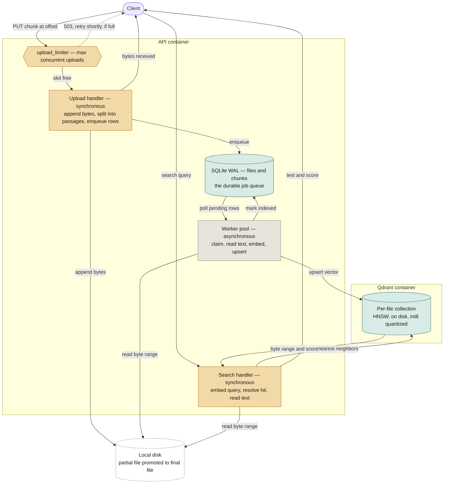

# Large File Processing & Search

A backend service that ingests text files up to **10 GB** on a machine with **4 GB of RAM**,
resumes interrupted uploads, and searches contents in **natural language** — matching on meaning
rather than keywords.

Searching `database connectivity problems` returns `Connection to database failed after 30
seconds.` even though they share one word.

---

## Setup

Two services: the API, and Qdrant for vector storage.

```bash
docker compose up --build                       # API on :8000, docs at /docs
docker compose --profile test run --rm tests    # test suite, against a real Qdrant
```

Without Docker (Qdrant is still required):

```bash
docker run -p 6333:6333 qdrant/qdrant:v1.12.1
python3 -m venv .venv && source .venv/bin/activate
pip install -r requirements.txt
uvicorn app.main:app
```

### Try it

Every route lives under `/v1`. Every request carries `X-User-Id` (any string), which scopes
files to their creator.

```bash
printf 'INFO Starting server\nERROR Connection to database failed after 30 seconds.\nINFO Ready\n' > sample.log
H='-H X-User-Id:demo -H Content-Type:application/json'
API=http://localhost:8000/v1

FILE_ID=$(curl -s -X POST $API/files $H \
  -d "{\"filename\":\"sample.log\",\"total_size\":$(wc -c < sample.log)}" \
  | python3 -c 'import sys,json; print(json.load(sys.stdin)["file_id"])')

curl -s -X PUT "$API/files/$FILE_ID/chunk?offset=0" -H 'X-User-Id: demo' --data-binary @sample.log
curl -s -X POST "$API/files/$FILE_ID/complete" -H 'X-User-Id: demo'
curl -s "$API/files/$FILE_ID/status" -H 'X-User-Id: demo'
curl -s -X POST "$API/files/$FILE_ID/search" $H \
  -d '{"query":"database connectivity problems","top_k":3}'
```

---

## Architecture

Interactive version with a side-by-side race-condition comparison:
**[Upload Pipeline Architecture](https://claude.ai/code/artifact/cd179b70-8d75-43b0-b6a8-20cace46a689)**



The one decision this follows from: **`PUT /chunk` never waits on embedding.** It appends bytes,
splits lines, and enqueues — all cheap — then returns. Embedding happens later, off the request, in
a worker pool reading the same SQLite queue. Search is the only path touching both Qdrant and disk
in one request, because a hit is a byte range that still has to be read back as text. The
`upload_limiter` gate is the one piece of backpressure on the upload path itself — see §1.

---

## API

Interactive documentation: **`/docs`** (Swagger UI — click **Authorize**, set `X-User-Id` once, then
"Try it out" on any endpoint to fire real requests against the running service with that header
applied automatically). A read-only, non-interactive reference is at **`/redoc`**. Every route
requires `X-User-Id`; a file owned by someone else 404s.

| Method | Path | Purpose |
|---|---|---|
| `POST` | `/v1/files` | Register an upload → `file_id` |
| `PUT` | `/v1/files/{file_id}/chunk?offset=N` | Upload one chunk (raw body) |
| `POST` | `/v1/files/{file_id}/complete` | Mark the upload finished |
| `GET` | `/v1/files/{file_id}/status` | Upload **and** processing progress; also the resume endpoint |
| `POST` | `/v1/files/{file_id}/search` | Natural-language search |
| `GET` | `/v1/files` | List your uploads |
| `DELETE` | `/v1/files/{file_id}` | Delete a file and its index |
| `GET` | `/health` | Liveness, workers, queue depth, Qdrant connectivity (unversioned — hit by infra tooling, not API clients) |

`PUT /chunk`: `offset` must equal `bytes_received`. `409` on mismatch (names the correct offset),
`413` over the chunk size limit, `400` only past the hard `MAX_FILE_BYTES` ceiling — the client's
`total_size` is a sizing hint, not an enforced cap.

`POST /complete`: called once every chunk is sent; this, not a byte count, is what finalizes the
upload. Idempotent.

`POST /search`: `{"query": "...", "top_k": 5}` → results with `text`, `start_byte`/`end_byte`, and
`score` (cosine similarity). Works **during** an upload — whatever is indexed so far is queryable.

---

## Design discussion

### 1. A 10 GB file on a 4 GB machine

The file is never held in memory: chunks are appended to disk and released as they arrive, so peak
memory scales with concurrent uploads, not file size. Chunk rows store `(start_byte, end_byte)`
rather than the text itself — the file on disk already has it, so nothing duplicates the corpus.

Vectors live in Qdrant, one collection per file, with raw vectors and the HNSW graph on disk and
only an int8-quantized copy (4× smaller than float32, ~2–3% recall cost) kept resident. Search is
approximate (HNSW), not exhaustive.

Passage size scales with declared file size (`config.passage_size_for`): small passages embed
precisely, but a 10 GB file at the smallest passage size would need ~22M vectors (~8 GB even
quantized), so larger files get proportionally larger passages, keeping the resident footprint
under 1 GB regardless of file size:

| File size | Passage target | Resident quantized |
|---|---|---|
| ≤1 GB | 600 B | ≤0.8 GB |
| 10 GB | 4,800 B | 1.0 GB |

The 4 GB budget applies to the whole service, not per container, so the two containers' Docker
memory limits are sized to sum to 4 GB: **API 2G, Qdrant 2G**
([docker-compose.yml](docker-compose.yml)) — hitting either ceiling gets that container OOM-killed
rather than silently degrading the host. An even split, not a size-proportional one: a live test
declaring a full 10 GB upload (so `passage_size_for()` produced true 10GB-scale passage sizes) while
uploading 180 MB of real content measured the API container peaking at ~880 MB (44% of a 2G limit)
during the upload-plus-immediate-embedding burst — notably higher than a static arithmetic estimate
predicted, because chunks can arrive faster than the fixed 2-worker pool drains them. Extrapolating
that run's Qdrant usage to the full 10 GB scale gives ~1.0 GB resident. An earlier 2.75G/1.25G split
gave Qdrant too little headroom at that extrapolated worst case relative to what the API actually
needed at its measured peak; 2G/2G gives both containers comparable real margin instead.

Nothing bounds concurrent embedding beyond the fixed worker count, but chunk *acceptance* had no
equivalent ceiling — an unbounded burst of concurrent `PUT /chunk` requests, each holding up to
`MAX_CHUNK_BYTES` in memory, could add up past the API container's limit with nothing pushing back,
and a container OOM-kill takes down every in-flight request, not just the excess ones.
`MAX_CONCURRENT_UPLOADS` (default 50, see [app/services/upload/concurrency.py](app/services/upload/concurrency.py)) caps
this the same way `WORKER_COUNT` caps embedding: past the limit, a chunk PUT gets `503` with
`Retry-After` immediately, rather than being queued or silently slowing the container down.

### 2. Interrupted uploads

`GET /status` reports `bytes_received`; the client resumes from there — no separate token.
`bytes_received` is committed per chunk, so this survives a process crash, not just a dropped
connection. A mismatched offset gets `409` naming the correct one, making retries idempotent. The
chunker's own state (a trailing partial line) is persisted too, so resume continues mid-line without
losing or duplicating text.

Completion is explicit (`POST /complete`), not inferred from `bytes_received >= total_size` — a
client-declared, unverified number. `total_size` is only a sizing hint; it's corrected to the real
byte count once `/complete` runs, and a client may send more than it originally declared.

### 3. Multiple concurrent uploads

Each upload is independent: its own `.partial` file, line-buffer state, and Qdrant collection. A
fixed worker pool caps concurrent embedding regardless of how many uploads are in flight, SQLite in
WAL mode lets uploads write while workers read, and a semaphore
(`MAX_CONCURRENT_UPLOADS`, §1) caps how many chunk PUTs may be held in memory at once, so a burst
of simultaneous uploads gets a `503`/`Retry-After` past the limit instead of risking the container's
memory ceiling.

Two requests for the *same* file at the *same* offset — what a client's retry logic produces when a
response is lost after the server already applied it — are serialized, not raced: the whole
read-check-append-write sequence for one chunk runs inside a single `BEGIN IMMEDIATE` transaction,
so a second concurrent request blocks until the first commits, then correctly fails its own offset
check instead of double-appending.

Identity is a client-supplied `X-User-Id` header, not authentication — the minimum needed to answer
"whose file is this." Files carry an `owner_id`; every route scopes to it, and a file that exists but
belongs to someone else returns `404` rather than `403`.

### 4. Processing and indexing efficiently

Indexing overlaps the upload rather than following it — each arriving chunk is split into passages
and queued immediately, so most of the file is searchable before the last byte lands. The file is
never re-read to build the index; passages are split from bytes already in the request handler's
memory.

Passages align to line boundaries: a network chunk boundary can fall mid-word, mid-line, or
mid-UTF-8-character, so the line buffer holds back the trailing incomplete line and prepends it to
the next chunk.

The `chunks` table is the job queue (`pending → processing → indexed | failed`), durable rather than
in-memory. Workers claim rows atomically; rows stranded by a crash reset to `pending` on startup.
Qdrant point IDs are derived from `(file_id, sequence)`, so re-embedding a passage after a crash
overwrites the same point instead of duplicating it.

### 5. How semantic search works

Passages are embedded with `all-MiniLM-L6-v2` into 384-dimensional vectors that place similar
meaning nearby regardless of wording. A query goes through the same model; Qdrant returns the
nearest passages with byte ranges attached as payload, so a hit maps straight to a file location
with no separate lookup. `database connectivity problems` and `Connection to database failed after
30 seconds` share only "database" — keyword search would rank it poorly — but both describe the same
failure, so the model places them close together. Passages overlap by 20% so a sentence split across
a boundary isn't embedded as two meaningless fragments.

### 6. Scaling to thousands of concurrent uploads and searches

- **Embedding CPU** (~500–1,500 passages/sec on CPU) → a GPU embedding service with aggressive
  batching.
- **In-process workers** → the queue interface (claim/complete/fail/recover) swaps SQLite for
  SQS/Kafka without touching worker logic, enabling many worker processes.
- **SQLite metadata** → Postgres, once several API nodes write concurrently.
- **Local disk** → S3 multipart upload, making API nodes stateless behind a load balancer.
- **Per-file Qdrant collections** → a clustered deployment with sharding/replication; past a certain
  file count, one shared collection with a `file_id` filter beats one-per-file.
- **Embedding volume itself** — a keyword index (FTS5/Elasticsearch) as a cheap first-pass filter,
  reserving embeddings for reranking a small candidate set, cuts embedding cost substantially.

---

## Project layout

Layered by role, with a one-way dependency direction: `api → services → repositories → db`, with
`rag/`, `tasks/`, and `core/` (each a distinct kind of cross-cutting or domain concern, detailed
below) reachable from the layers above.

```
app/
├── main.py             # FastAPI app assembly and lifespan only -- wires the pieces below together
├── schemas/            # Pydantic request/response shapes
├── api/
│   ├── deps.py          # shared Depends(): get_user_id, acquire_upload_slot
│   └── v1/              # HTTP layer only: parse request, call a service, shape response
│       ├── router.py     # aggregates every v1 route
│       ├── upload.py
│       └── search.py
├── services/            # Business rules and orchestration -- no SQL, no HTTPException
│   ├── upload_service.py     # orchestrator -- the only thing api/ imports for uploads
│   ├── search_service.py
│   └── upload/                # upload_service's supporting files, not services in their own right
│       ├── validators.py      # binary-content detection
│       └── concurrency.py     # the concurrent-upload cap
├── rag/                 # the RAG pipeline: chunk -> embed -> store -> retrieve
│   ├── ingestion/
│   │   ├── chunker.py    # bytes -> line-aligned passage ranges
│   │   └── embedder.py   # text -> vectors (sentence-transformers)
│   ├── retrieval/
│   │   └── retriever.py  # nearest-neighbor search over a file's vectors
│   └── pipeline.py       # embed-and-store orchestration for one batch of passages
├── tasks/               # background job machinery (in-process threads, not Celery --
│   │                    #   there is no message broker in this deployment)
│   ├── job_queue.py      # queue semantics: batching, retry policy, files<->chunks coordination
│   └── worker.py         # the thread pool that drains it
├── repositories/        # persistence only -- no business rules, no queue semantics
│   ├── sql_repository.py       # aggregator: sql_repository.files / sql_repository.chunks
│   ├── vector_repository.py    # Qdrant collection storage (the write/ownership side)
│   ├── file_storage_repository.py  # on-disk layout, atomic finalize, byte-range reads
│   └── sql/                    # one file per SQL table, imported only via sql_repository
│       ├── file_repository.py   # SQL for the `files` table
│       └── chunk_repository.py  # SQL for the `chunks` table
├── core/                # cross-cutting, no domain knowledge
│   ├── config.py
│   ├── exceptions.py     # domain exceptions, one per failure case
│   ├── error_handlers.py # maps each domain exception to an HTTP status + body
│   ├── logging_config.py # process-wide logging setup
│   └── openapi.py        # X-User-Id security scheme, hand-written chunk-upload schema
└── db/
    └── db.py             # SQLite connection, schema, transactions
```

Every service lives flat at the top of `services/`, so opening that folder shows every service at a
glance; a service with too much supporting code (like `upload_service.py`'s validation and the
concurrency cap) gets a same-named subfolder for those *extra* files, but the orchestrator itself
never moves into it.

`repositories/` holds three kinds of persistence, one file (or aggregator) per kind, so opening that
folder shows every way this service touches storage at a glance: SQL (`sql_repository.py`, backed by
`sql/file_repository.py` and `sql/chunk_repository.py`, one per table), Qdrant
(`vector_repository.py`), and plain disk I/O (`file_storage_repository.py` -- upload layout, atomic
finalize, byte-range reads, shared as-is by `services/upload_service.py`,
`services/search_service.py`, and `tasks/worker.py`, so it doesn't belong to any one of them).
Callers never import `sql/file_repository.py` or `sql/chunk_repository.py` directly; they go through
`sql_repository.files.*` / `sql_repository.chunks.*` so there's exactly one import path for SQL
regardless of how many tables exist behind it.

Table SQL is split the same way for `files` and `chunks`: `sql/file_repository.py` and
`sql/chunk_repository.py` hold only queries and row<->object translation, while `tasks/job_queue.py`
owns the semantics on top -- batching a claim, deciding retry vs. failure, and keeping both tables
consistent inside one transaction. Queue rows never carry passage text (see below), so this is
metadata- and coordinate-only persistence, same as the `files` side.

A handler in `api/v1/` never touches SQL or raises `HTTPException` for a domain reason: it calls a
service, and any `app.core.exceptions.DomainError` the service raises is translated to the right
status code by one exception handler per error type, registered by
[app/core/error_handlers.py](app/core/error_handlers.py)'s `register_error_handlers(app)` — the
mapping lives in exactly one place rather than being repeated at every raise site. Services call
repositories for persistence and `rag` for domain utilities; they never import FastAPI, so
`upload_service.append_chunk()` or `search_service.search()` can be called and tested with no HTTP
framework involved.

**Why `rag/` and `tasks/` are separate from each other.** `rag/pipeline.py`'s `ingest_batch()` is a
pure function — text and coordinates in, embedded vectors stored, no knowledge of retries or
threads. `tasks/worker.py` owns claiming work from the queue, retrying failures, and the thread
lifecycle, then calls into `rag/pipeline.py` for the actual embed-and-store step. This mirrors the
split a Celery-based deployment would have (task functions vs. the worker pool that runs them),
without requiring an actual message broker for a service meant to run locally.

**No `rag/generation/` stage.** The assignment asks for the most relevant *sections* of the file
back, not an LLM-generated answer over them — retrieval returns the matched source passages
directly. Adding a generation stage would require an LLM this service doesn't call.

Every route is mounted under `/v1` — the directory is a real version boundary, not just a
naming convention, so a future v2 can be added as a sibling package without touching v1's code.

| Module | Responsibility |
|---|---|
| [app/main.py](app/main.py) | FastAPI app assembly and lifespan; wires routers, error handlers, OpenAPI together |
| [app/core/exceptions.py](app/core/exceptions.py) | Domain exceptions, one per failure case |
| [app/core/error_handlers.py](app/core/error_handlers.py) | Maps each domain exception to an HTTP status + body |
| [app/core/openapi.py](app/core/openapi.py) | X-User-Id security scheme, hand-written chunk-upload schema |
| [app/core/logging_config.py](app/core/logging_config.py) | Process-wide logging setup |
| [app/core/config.py](app/core/config.py) | Environment-driven settings |
| [app/api/deps.py](app/api/deps.py) | Shared dependencies: identity, the upload-slot limiter |
| [app/api/v1/upload.py](app/api/v1/upload.py) | Parse the request, call `upload_service`, shape the response |
| [app/api/v1/search.py](app/api/v1/search.py) | Parse the request, call `search_service`, shape the response |
| [app/services/upload_service.py](app/services/upload_service.py) | Offset validation, size limits, state transitions |
| [app/services/upload/validators.py](app/services/upload/validators.py) | Detects non-text (binary) content |
| [app/services/upload/concurrency.py](app/services/upload/concurrency.py) | Caps concurrent chunk uploads held in memory |
| [app/services/search_service.py](app/services/search_service.py) | Embed the query, ask the retriever, resolve hits to text |
| [app/rag/ingestion/chunker.py](app/rag/ingestion/chunker.py) | Bytes → line-aligned passage ranges |
| [app/rag/ingestion/embedder.py](app/rag/ingestion/embedder.py) | Text → vectors |
| [app/rag/retrieval/retriever.py](app/rag/retrieval/retriever.py) | Nearest-neighbor search over a file's vectors |
| [app/rag/pipeline.py](app/rag/pipeline.py) | Embed-and-store orchestration for one batch |
| [app/tasks/job_queue.py](app/tasks/job_queue.py) | Queue semantics: batching, retry policy, claim/complete/fail/recover |
| [app/tasks/worker.py](app/tasks/worker.py) | Background thread pool draining the queue |
| [app/repositories/sql_repository.py](app/repositories/sql_repository.py) | Aggregator: the one import path for every SQL table |
| [app/repositories/sql/file_repository.py](app/repositories/sql/file_repository.py) | SQL for the `files` table only |
| [app/repositories/sql/chunk_repository.py](app/repositories/sql/chunk_repository.py) | SQL for the `chunks` table only |
| [app/repositories/vector_repository.py](app/repositories/vector_repository.py) | Per-file Qdrant collection, idempotent upserts |
| [app/repositories/file_storage_repository.py](app/repositories/file_storage_repository.py) | On-disk layout, atomic finalize, range reads |
| [app/db/db.py](app/db/db.py) | SQLite connection, schema, transactions |

---

## Testing

```bash
docker compose --profile test run --rm tests
```

- **`test_chunker.py`** — lossless passage tiling under arbitrary splits; UTF-8 boundaries.
- **`test_upload.py`** — chunked upload, interruption, resume, completion, ownership isolation.
- **`test_concurrency.py`** — racing identical chunk requests: exactly one succeeds.
- **`test_upload_limiter.py`** — the concurrent-upload cap: peak concurrent holders never exceeds
  the limit, a full set of slots rejects cleanly, a released slot is reusable.
- **`test_validators.py`** — the binary/text boundary: null bytes and common binary signatures
  (PNG, PDF, zip) are rejected, a chunk boundary landing mid-multibyte-character is not.
- **`test_job_queue.py`** — exclusive claiming, retry-then-fail, crash recovery.
- **`test_config.py`** — a 10 GB file's resident footprint stays within budget.
- **`test_search.py`** — the assignment's example, ranking, byte offsets, search mid-upload.

Also verified by hand against the running stack: `docker kill` on the API mid-upload → restart →
resume → md5-identical file; Qdrant's on-disk/quantization config confirmed live via `curl`; a
second `X-User-Id` gets `404` on someone else's file from every route; paraphrased queries
(`"running out of storage space"` → `"No space left on device"`, no shared words) retrieving the
right section; memory sampled live via `docker stats` through a real 22.7 MB upload, staying well
under both containers' limits; and, with `MAX_CONCURRENT_UPLOADS` set to 3, firing 8 concurrent 8 MB
chunk uploads resulted in exactly 3 accepted and 5 rejected with `503`/`Retry-After` in ~30ms each.

### End-to-end script

[scripts/e2e_test.py](scripts/e2e_test.py) automates that hand verification into one runnable
script against a real running instance -- HTTP calls only, no pytest, no mocking. It starts the
stack, then offers an interactive menu covering the full lifecycle: register an upload, send it in
small chunks with a simulated mid-upload interruption (asserting `/status` reports the exact resume
offset), complete it, poll until indexing catches up, run the assignment's own semantic search
example, confirm a second `X-User-Id` is refused the file, list it, then delete it and confirm it's
gone. Picking a step that depends on an earlier one (e.g. search needs a completed upload) runs
whatever hasn't happened yet for you first.

Every menu choice always redoes its real work -- picking the same number twice in a row (or
picking "register" again mid-session) runs it again rather than silently skipping, which doubles as
a live check of the API's own idempotency: `complete` is called twice in a row and must return
`upload_status=completed` both times rather than erroring the second time, and `delete` is likewise
followed by a second delete of the same (now-unknown) `file_id`, which must 404 rather than fail
oddly. Each step prints its `[PASS]`/`[FAIL]` lines plus a `stats:` line with the relevant counters
for that step (bytes/chunks/passages sent, HTTP status, elapsed seconds, indexed/failed counts,
search scores, and so on). Shows the menu again after each choice and exits non-zero if anything
failed.

```bash
python3 scripts/e2e_test.py               # interactive menu (starts docker compose first)
python3 scripts/e2e_test.py --all         # run every step once, in order, no menu
python3 scripts/e2e_test.py --no-compose  # reuse a stack already running via docker compose up
```

Uses `httpx`, already a dependency (see [requirements.txt](requirements.txt)) for the test
suite's `TestClient` -- nothing extra to install. The sample log it uploads,
[scripts/sample.log](scripts/sample.log), contains the same "Connection to database failed after
30 seconds." line the assignment's example searches for.

---

## Limitations

- **One API process** — the worker pool is in-process; scaling out means the changes in §6.
- **One Qdrant collection per file** — simple at this scale, but a shared collection with a filter
  is the better trade past a few thousand files.
- **Text files only**, no PDF/DOCX extraction — a binary upload's first chunk is checked for null
  bytes and invalid UTF-8 and rejected with `415` before anything is written or indexed
  ([app/services/upload/validators.py](app/services/upload/validators.py)), rather than silently indexing decode-noise.
- **Identity, not authentication** — `X-User-Id` is trusted as given; a real deployment would put an
  auth layer in front of it.
- **Startup crash-recovery assumes one process** — safe because it runs before the server accepts
  connections; a multi-replica deployment would need a heartbeat instead of inferring liveness from
  a status string.
- **Indexing lags on very large files** — a 10 GB upload finishes indexing minutes after the last
  byte; `/status` reports this honestly.

---

## AI tools used

Built with **Claude Code**. The design was pressure-tested by working through concrete scenarios end
to end rather than reviewing in the abstract — tracing what a 10 GB file's index actually costs in
memory, what a client that mis-declares its own file size does to completion logic, what two
retried requests racing each other do to a file on disk. That process is what produced the current
design: Qdrant over a hand-rolled index (real on-disk, quantized, approximate search instead of one
that only claimed to be), an explicit completion endpoint instead of trusting client-declared size,
a transaction boundary that makes concurrent chunk uploads safe, and lightweight ownership scoping.
Test coverage and the manual verification above reflect the same approach: asserting the actual
property that matters (a file ends up byte-identical after a crash, exactly one of five racing
requests succeeds) rather than that the code merely runs.
